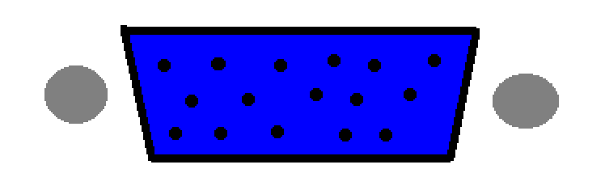
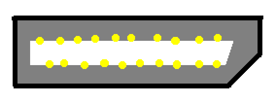
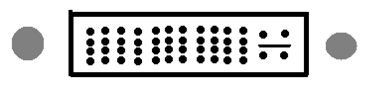

---
header-includes:
- \usepackage{multicol}
- \newcommand{\hideFromPandoc}[1]{#1}
- \hideFromPandoc{
    \let\Begin\begin
    \let\End\end
  }
---

# CS 312 Homework 1

## Robert Detjens

---

### 1. What does the clock generator on a motherboard do?

The clock generator provides the base clock for the system. The CPU/BIOS uses this to calculate the processor
frequency, run peripherals, and basically everything else.

### 2. What is the resonant circuit in the clock generator usually made from?

Quartz!

### 3. What is an anti-static wrist strap for?

Static electricity can build up on our body when moving around. The grounding strap (or just touching grounded metal)
discharges any static buildup safely instead of through components when being handled, potentially damaging them.

### 4. Why is it important to be grounded when working inside of a PC?

ESD can damage components when a charge buildup from our bodies is sent through sensitive electronics.

### 5. What is the commonly-given maximum resolution of the ubiquitous VGA connector at 85 HZ? Does it surprise you that it reaches that resolution? Why or why not?

2048×1536 or QXGA. As VGA is an analog signal that closely matches the internals of a CRT and does not have a clock
signal, resolution is theoretically limited only by how fast the source computer can vary the output voltages (and
interference in the cable).

### 6. Discuss the term "Wintel", and its dominance in the PC marketplace.

"Wintel" is a portmanteau of Windows and Intel, referring to the overwhelming majority of Intel-based PCs running
Windows throughout the 2010s. AMD processors during this era were not competitive at all, and Windows was (and
continues to be) the operating system of choice for the vast majority of users. Recently, AMD's recent Ryzen
processors have gotten significantly better, taking the performance crown with recent releases.

### 7. Suppose that a customer of yours wants to replace the CPU in their custom desktop PC. Write up a brief set of instructions, walking the user through how to do it. (Note: does not have to be perfect!)

1. Open the case
2. Remove the GPU
   1. Unplug cables
   2. Remove screw(s) from slot covers
   3. Undo PCIe slot latch
   4. Remove card
3. Remove motherboard from case
   1. Unplug cables
   2. Remove all screws
   3. Remove from case
4. Remove cooler
   1. Unscrew screws
   2. Remove gently -- thermal paste will be sticky
5. Remove CPU
   1. Undo latch on side of socket
   2. Remove CPU carefully -- pins inside the socket are very fragile!
6. Install new CPU
   1. Place gently into socket -- mind the pins again!
   2. Latch socket
7. Reinstall cooler
   1. Apply thermal paste to top of CPU
   2. Seat cooler on top
   3. Install screws until pretty tight
8. Reinstall motherboard
   1. Place in case
   2. Install screws
   3. Reconnect cables
9. Reinstall GPU
   1. Install into slot
   2. Plug into cables
10. Close case

### 8. What is a motherboard beep code, and why are they important?

Beep codes are a way for the motherboard BIOS to indicate POST codes with a series of beeps. Newer motherboards do not
have a PC speaker and commonly use a series of LEDs or a 7-segment display instead.

### 9. What is USB-C, and how is it an improvement over previous designs?(4 points)

USB-C is the next-generation peripheral connector. It can carry pretty much any signal from USB 2 all the way up to
full-on PCIe x4. The connector is reversible and more durable than previous designs (especially Micro) and has been
replacing every port on laptops over the last few years.

### 10. Draw the following video jacks:

These were fun to draw!

\Begin{multicols}{2}

a. HDMI (full-size)

{ height=80px }

b. VGA

{ height=80px }

c. DisplayPort (full-size)

{ height=80px }

d. DVI-I

{ height=80px }

\End{multicols}
