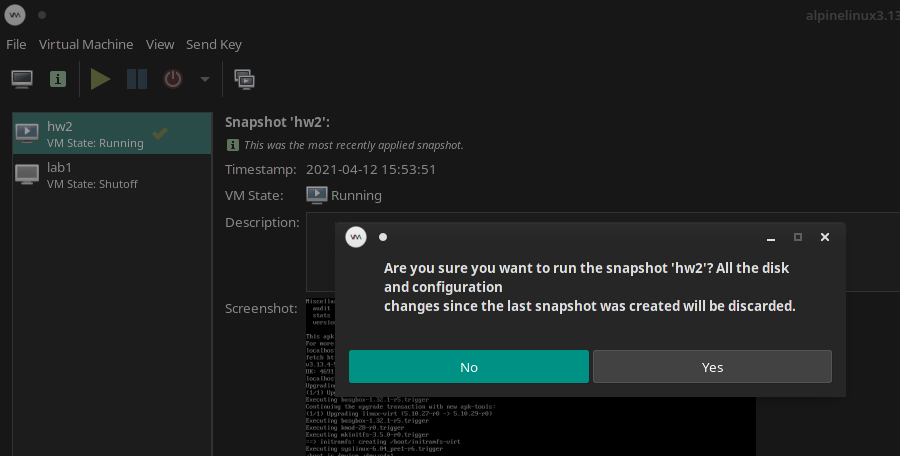

# CS 312 Assignment 2

## Robert Detjens

---

### 1. What is a DIMM memory module? When a slot in a laptop is labelled "DIMM", what official form factor name is usually intended? (Hint: it is so very close to "DIMM")

DIMM (Dual Inline Memory Module) is the standard desktop RAM component. Laptop memory comes in SO-DIMMs.

### 2. All we really need to open up a desktop or laptop is a couple screwdrivers and often a pry-tool of some kind. Time issues aside, if you have done this before do you find it easy? What kinds of electronics do you think you shouldn’t open?

Super easy! I've opened almost every electronic component I own. I stay far away from any power supplies or
high-voltage components, as those can produce dangerous shocks.

### 3. What is the backlight in a laptop screen? How is the light generated? Why does it appear to be coming from the screen itself?

LCDs require a backlight to produce an image, as the liquid crystals do not produce light on their own. Backlights now
are LEDs edge-lighting a diffusion layer. Older displays used a CFL.

OLEDs do not require a backlight since each pixel emits its own light, allowing for perfect blacks (no bleed-through)
and great color accuracy.

### 4. What is a Kensington Security Slot?

These are non-electrical connectors that allow a device to be locked to a cable, preventing removal; e.g. locking a
school lab laptop to the desk.

### 5. Describe a scenario where data could be deleted from a HDD yet recovered afterwards.

When a file is deleted, only the record of it in the filesystem contents is deleted and the actual data of the drive is
marked as "not in use". The actual data itself is not zero'd and can be read out if it has not been overwritten with
new data and the location of the old data is known.

### 6. What is the TRIM command (as used on SSDs)? How does it solve the problem of “write amplification”?

SSDs can write to empty blocks but can only erase entire pages (groups of blocks). In order to erase a block, the
entire page needs to be read, modified, then entirely re-written. Hard drives can overwrite data in-place and do not
need to take extra steps. The drive is not aware of what blocks the filesystem has marked as dirty, so the TRIM command
was added to tell the drive what blocks are "dirty" and can be erased as part of the controller's garbage collection.

### 7. Is it okay to perform disk management operations on a drive, that contains files you care about, but which are not backed up? Is that always the case?

Disk operations like `TRIM` and defragmentation are safe, but formatting the partition or drive will delete all data on
it.

### 8. What is your current backup strategy for personal and school files? If we don’t have one, what plan could we propose to keep our important files safe? What is the chance you’ll adopt that plan (we will probably bring this up again later!)?

I throw all school stuff into Git repositories. For personal backups, I use Git for projects and a NAS for media.

### 9. What is the difference between a file system and a volume?

File systems dictate the layout and structure of data on a physical disk. Volumes and partitions are ways to section a
disk into multiple distinct areas. Volumes are more of "virtual partitions" and can commonly be manipulated more
easily, e.g. with Linux LVM.

### 10. Name another few virtual machine hypervisors other than VirtualBox.

Linux KVM, Xen, Hyper-V.

### 11. In VirtualBox (just for a bit of practice with snapshots!)

I'm using `virt-manager` / QEMU for VMs, since VirtualBox does not play nice with my system. Changes to snapshots are
not shown in the GUI. Restoring a snapshot after further modifying the system does warn about changes, though.

