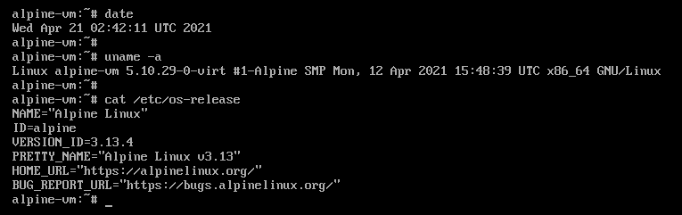
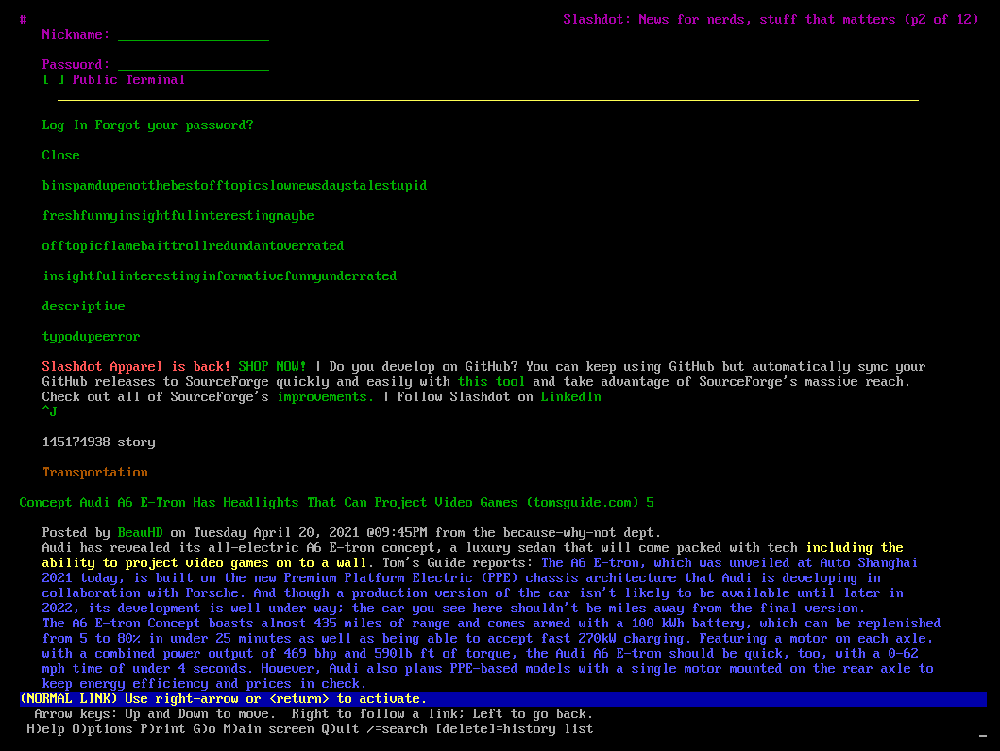

# CS 312 Homework 2

## Robert Detjens

---

### 1. Windows VM

{ width=90% }

$\pagebreak$

### 2. Alpine VM

{ height=90% }

{ width=80% }

$\pagebreak$

### 3. User directories

Windows user directories are under `C:\Users\$USER`, Linux ones under `/home/$USER`.

### 4. `/usr` meaning

In early Unix, `/usr` was the user directory similar to `/home` in modern Linux. However, due to many factors of the
underlying architecture of early Unix machines, `/usr` was used for system binaries and programs instead of users as
the root `/` disk filled up. `/usr` has turned into a backronym for Universal System Resources.

### 5. The family of `/bin`s

Traditionally, `/sbin` houses system binaries run only by the superuser and `/bin` has normal programs accessible by
any user. Binaries are placed in `/{,s}bin` if they are essential for system operation and/or needed very early on in
the boot process before any filesystems are mounted, since `/usr` may be on a separate partition. Binaries under
`/usr/{,s}bin` are not needed until after the system had started.

On more modern distributions, e.g. Arch, these directories have all been consolidated into one directory: `/usr/bin`.
