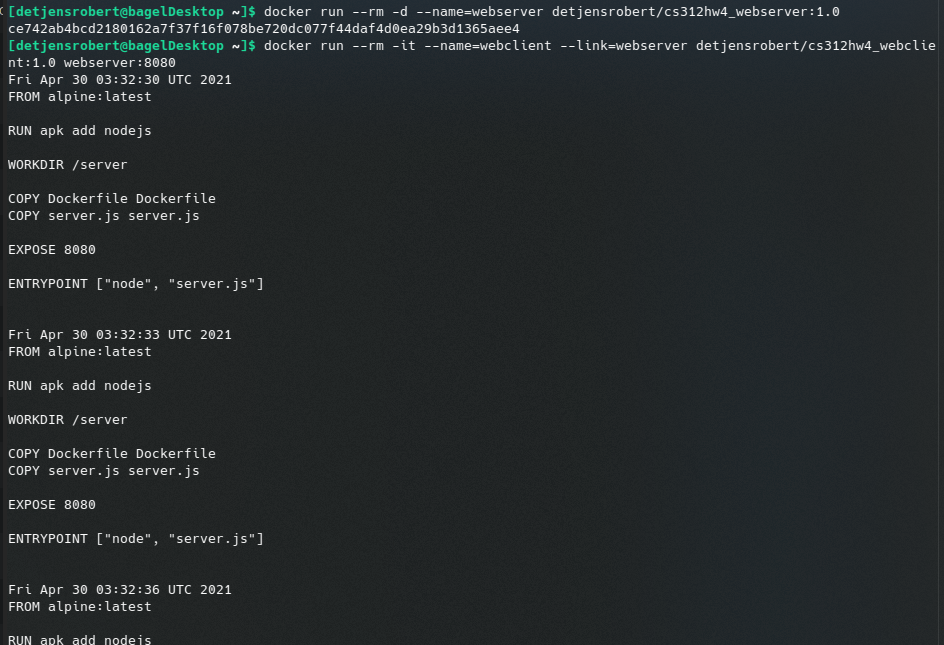

# CS 312 Homework 4

## Robert Detjens

---

### 1. What is your Docker Hub username?

`detjensrobert`.

### 2. Include a screenshot of the setup and study tasks working.

{ width=70% }

### 3. Write up a set of short and simple instructions to show the LAs how your webclient can get data from your webserver.

A simple way to get the containers to talk to each other is to have the client linked to the server. When linked,
Docker adds the linked container as an entry in `/etc/hosts` and the client can simply access the other container by
name:

```bash
$ sudo docker run --rm -d --name=webserver detjensrobert/cs312hw4_webserver:1.0
ce742ab4bcd2180162a7f37f16f078be720dc077f44daf4d0ea29b3d1365aee4

$ sudo docker run --rm -it --name=webclient --link=webserver \
  detjensrobert/cs312hw4_webclient:1.0 webserver:8080
Fri Apr 30 03:10:06 UTC 2021
FROM alpine:latest

RUN apk add nodejs
...
```

$\pagebreak$

### 4. Explain what each of the required flags in the above question does in the context of the container's behavior.

`--rm`
: When the container is stopped, remove it. By default, a container will stick around and can be restarted.

`-d` / `--detach`
: Run the container in the background. The "d" is for daemon.

`-i` / `--interactive`
: Keep STDIN open and attached to the current terminal.

`-t` / `-tty`
: Allocate a TTY / terminal inside the container for the current terminal to attach to.
