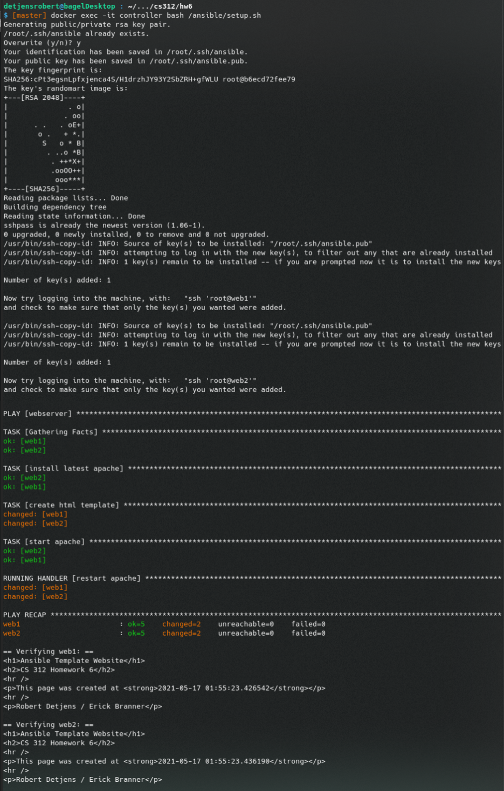

# CS 312 Homework 6

## Robert Detjens, Erick Branner

---

## Setup Steps

### 1. Create Docker network

```bash
docker network create ansible
```

### 2. Create controller container

```bash
docker build --file=containers/Dockerfile.controller --tag=ansible-controller:1.0 .
docker run --rm -d --net=ansible --privileged -v "$(pwd)/ansible:/ansible" \
  --name=controller ansible-controller:1.0
```

Mounting `./ansible` into the container as `/ansible` will let the container access the playbook, template file,
and setup script.

### 3. Create client containers

```bash
docker build --file=containers/Dockerfile.client --tag=ansible-client:1.0 .
docker run --rm -d --net=ansible --privileged --name=web1 ansible-client:1.0
docker run --rm -d --net=ansible --privileged --name=web2 ansible-client:1.0
```

### 4. Run Ansible script

```bash
docker exec -it controller sh /ansible/setup.sh
```

- Ansible playbook: `webserver.yml`
- Runner script: `setup.sh`

$\pagebreak$

## Script Output

{ height=90% }
