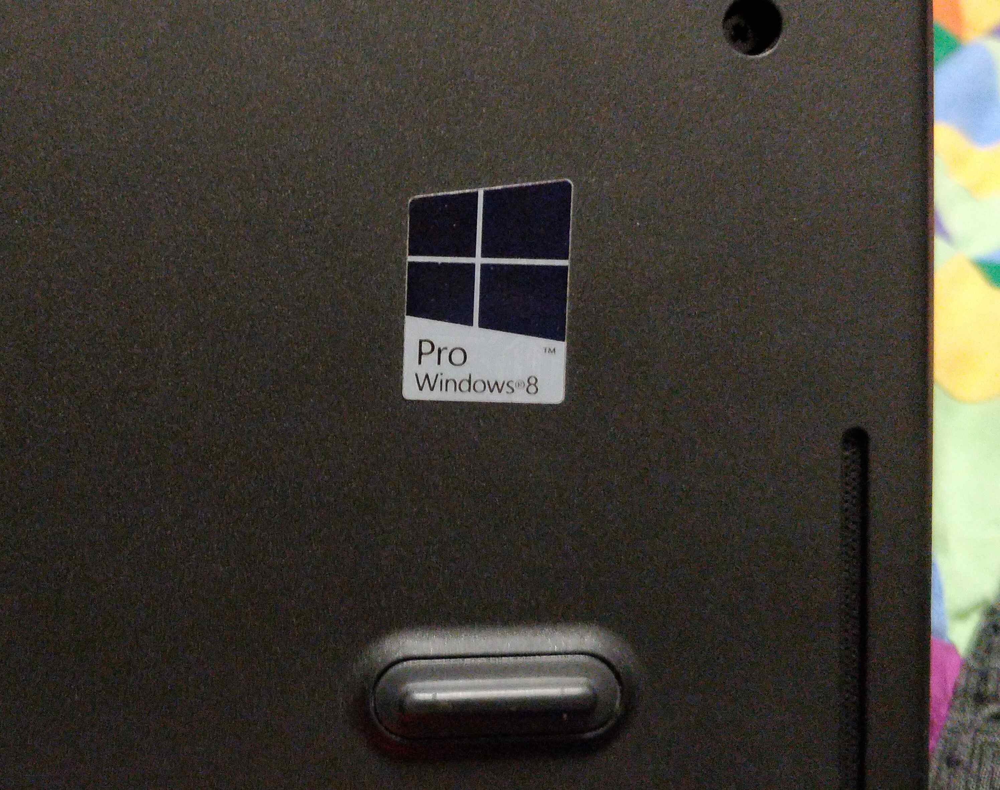
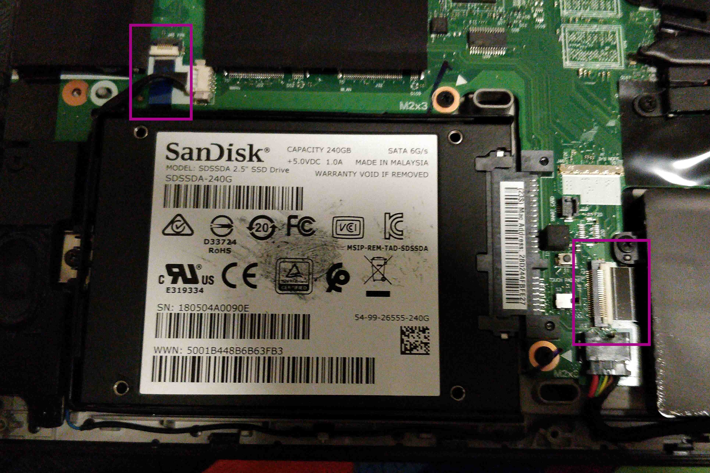

# CS 312 Lab 3

## Robert Detjens

---

> Note: This disassembly was performed on my ThinkPad T440.

### 0. What resources did you use to see a laptop disassembled or otherwise learn about to answer the questions? Keep track of what you find, either as pictures or hyperlinks to media. Yes, this makes this lab a bit of an Internet scavenger hunt, but it should not be too difficult if you know what to ask or maybe who to ask.

My own laptop! I have disassembled this laptop several times so this is all from my own experience.

### 1. There is often a Media Access Control (MAC) address printed on a white sticker on the MOBO. This is the MAC address of the built-in Ethernet interface. What is the MAC address for a MOBO you have seen?

Ethernet MAC address is `28:d2:44:fb:fe:27`.

{ width=50% }

### 2. There may be a tiny gray momentary push-button switch on the MOBO labeled SW154. Guess what might it be used for? Explain your answer.

It's labeled `SW1` on this ThinkPad. I assume this is a BIOS reset / CMOS clear button, as that is what similar
switches would do on desktop motherboards, but I do not have the manual to check and I doubt the button is standard
across all laptops.

{ width=50% }

### 3. When one is present, where is the credit-card sized “Smartcard” reader located?

On my ThinkPad, it would be on the left side of the laptop under the internal battery. Looks like it would connect to
the mainboard with the ribbon connector marked in pink.

{ width=50% }

### 4. What Operating System was this laptop designed for? How can you tell?

The venerable Windows 8, according to the sticker on the back of the laptop.

{ width=50% }

### 5. On the plastic bottom frame is often listed the input voltage for a laptop. What is the required voltage?

20V input.

{ width=50% }

### 6. Just under the required voltage are the amperage requirements. A connected power charger needs to be able to provide at least the smaller of the two numbers. What is the smaller amperage listed?

2.25A minimum.

{ width=50% }

### 7. How are a keyboard and trackpad hooked up on a laptop?

These are commonly hooked up with ribbon cables. On my laptop, the keyboard is on the left and the trackpad on the
right in the below image.

{ width=50% }

### 8. How is the screen lit on a laptop?

Most LCD panels s require a backlight to produce an image, as the liquid crystals do not produce light on their own.
Backlights now are LEDs edge-lighting a diffusion layer. Older displays used a CFL.

OLED panels do not require a backlight since each pixel emits its own light, allowing for perfect blacks (no
bleed-through) and great color accuracy.

### 9. What kinds of IO ports are found on a laptop?

Laptops usually have a few USB-A ports, maybe a USB-C / Thunderbolt or two if they are newer. There may also be some
display outputs like HDMI or Mini-DP (or VGA if it is old enough). Some also have an SD card reader.

$\pagebreak$

### 10. Is it possible to upgrade a laptop? Are some able to be upgraded more than others? Explain your answers.

Not to the degree that a desktop or server are. Newer laptops are even less upgradeable, with only the storage not
soldered to the mainboard.

My laptop has upgradeable RAM, storage, and WiFi.

{ width=80% }

(apologies for blurry image!)
