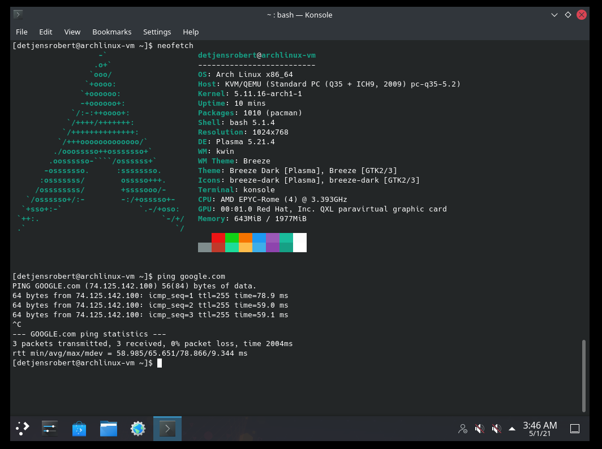
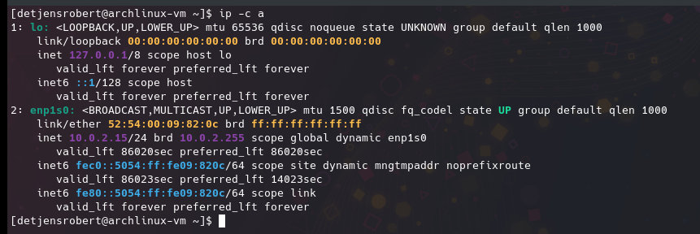

# CS 312 Lab 4

## Robert Detjens

---

### 1. What are some differences between GPT and MBR-style partition tables?

MBR stores the partition table in the boot sector (the first sector on a disk) along with the bootloader. Due to
limitations in the partition table format, MBR cannot address space above 2 TiB. GPT allows for disks up to 8 or 64
ZiB, depending on sector size. GPT can use multiple sectors for partition data.

### 2. What are some differences between the EXT4 and FAT32 filesystems?

FAT32 has a max filesize of 4GiB and partition size of 2TiB, ext4 supports files up to 16TiB and partitions up to 1EiB.
ext4 also has a journal, allowing for better recovery in the event of a crash before all data is flushed to disk. FAT
has no such protections and a crash may leave the fs in an incomplete state if interrupted.

### 3. Capture a screenshot showing that you can ping a website or server on the internet.

### 4. What is the IP address of your VM?

`10.0.2.15`

### 5. What is the name of your ethernet adapter?

`enp1s0`.

### 6. What are three types of platforms other than `i386-pc` that `grub-install` can target?

- `arm64-efi`
- `riscv64-efi`
- `x86_64-efi`

and 21 other platforms!
