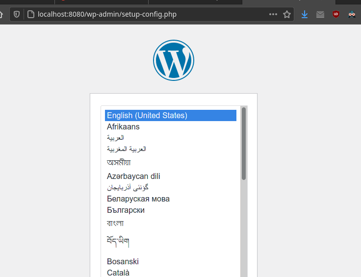
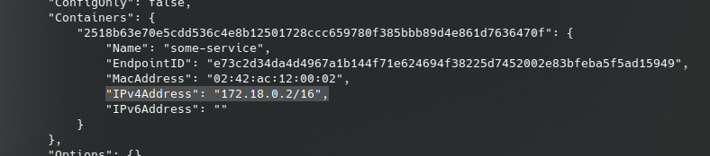
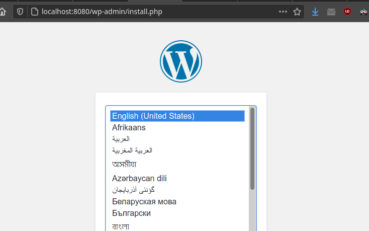
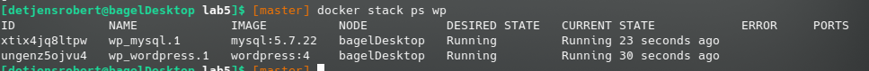
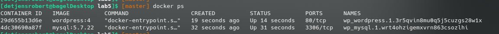

# CS 312 Lab 5

## Robert Detjens

---

### 1. Get a screenshot of the WordPress setup page.



### 2. What IPv4 address does the `some-service` container have?

`172.18.0.2`



### 3. What single docker command starts up a container that successfully pings the `some-service` container with 3 ping packets, then removes itself after it runs?

```bash
$ docker run --rm --network=some-project alpine ping -c 3 some-service
```

### 4. Get a screenshot of the WordPress setup page via the Docker network.



### 5. Get a screenshot of the `docker stack ps wp` command works



### 6. Get a screenshot of the `docker ps` command shows the two containers having a different up time in the Status field.


