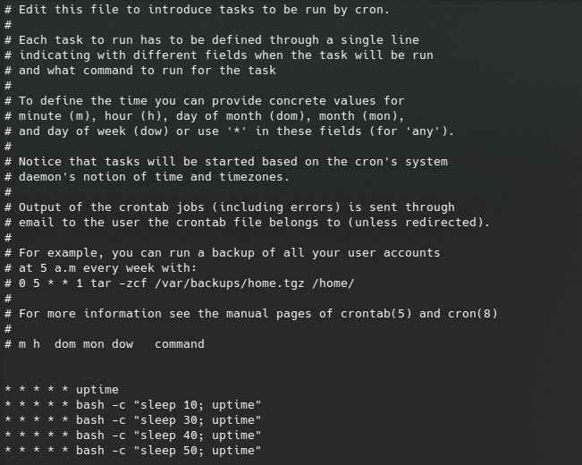
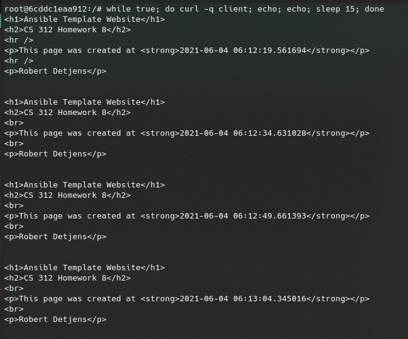

# CS 312 Lab 8

## Robert Detjens

---

### 1. Take a screenshot showing that you are viewing the successful ping of `www.orst.edu` inside `mutt`.

### 2. Take a screenshot showing that you are receiving emails by the minute inside `mutt` that contain uptime reports.

### 3. Individual crontab entries are only processed once per minute. Write a crontab that will execute the uptime command every 10 seconds. Take a screenshot showing that you have this crontab created in your VM.

```crontab
* * * * * uptime
* * * * * bash -c "sleep 10; uptime"
* * * * * bash -c "sleep 30; uptime"
* * * * * bash -c "sleep 40; uptime"
* * * * * bash -c "sleep 50; uptime"
```

{ height=400px }

### 4. Take a few screenshots (at least three curl responses, each 15 seconds apart) showing that you can repeatedly execute `curl $ALPINE_IP` to display a web page that changes to a new timestamp every 15 seconds.

{ height=400px }
