# PH 104 Lab 2: The Celestial Sphere and Sky Maps

## Robert Detjens

---

The CELESTIAL SPHERE is an imaginary sphere around Earth, with all the objects of the sky pinned upon it. It’s a useful
idea for thinking about how the sky changes over the course of the year. Astronomers divide the entire sky into 88
CONSTELLATIONS– distinct, irregularly shaped regions much like countries on Earth. The date, time, and location of an
observation determine which constellations can be seen. Star maps show half of the sky as it appears on a particular
date and time, and from a particular location.

The ECLIPTIC is the path the Sun takes through the sky against the background stars. If the Sun is in the direction of
Virgo, we might say, "The Sun is in Virgo". The set of constellations along the ecliptic make up the ZODIAC. The
planets of our Solar System are always close to the ecliptic in the sky.

The CELESTIAL EQUATOR is directly above Earth’s equator. Because Earth’s pole is tilted with respect to its orbit, the
celestial equator is tilted with respect to the ecliptic. The two locations in the sky where the celestial equator and
ecliptic cross are called EQUINOXES. This term also corresponds to the dates the Sun is at those locations. For
example, in the Northern Hemisphere, the vernal (spring) equinox is the position of the Sun on March 21.

SOLSTICES mark the locations on the ecliptic where the Sun is farthest from the celestial equator, and also indicate
the date when the Sun is at those locations. The star maps used in this activity show the sky at midnight on the dates
for the northern vernal equinox, northern summer solstice (Sun is at its farthest north from the celestial equator),
northern autumnal equinox, and northern winter solstice (Sun at its farthest south of the celestial equator).

At any time and in any location, the ZENITH is the point directly above your head. The HORIZON is a circle around you
such that if you point at the zenith with one arm and the horizon with the other, your arms form a 90-degree angle. The
MERIDIAN is the imaginary line in the sky passing from due north to due south through the zenith. The star maps are
completely accurate if we lived on Earth's the equator, with the celestial equator passing through our zenith and the
north celestial pole on the northern horizon. The star maps used here have been modified slightly to show the
approximate east-to-west horizon for 30-degrees and 45 degrees north latitudes, as well as the ecliptic.

Most of us will never travel to the North Pole, but we can investigate the sky as it would look if we did stand there.
If we were to look straight up -- at our zenith -- we would see the NORTH CELESTIAL POLE (NCP) directly overhead. The
celestial equator wraps around our horizon, and all of the northern hemisphere stars are CIRCUMPOLAR -- they neither
rise nor set but are always above the horizon. We may see only half of the sky at the North Pole, but the stars we see
never set.

Our lab emphasizes what is viewable at midnight as we look south on the dates of the equinoxes and solstices. We will
be investigating: Which constellations are rising in the east? Which constellations are on the meridian? Which
constellations are setting in the west?

The Sun, Moon, and the stars rise in the east and set in the west, with an approximate 24-hour cycle. This motion is
because Earth rotates on its axis – counterclockwise from west to east – as seen if we were looking down from above the
North Pole (Figure 1). The Earth also revolves around the Sun counterclockwise. These two motions of the Earth explain
why the sky changes.

$\pagebreak$

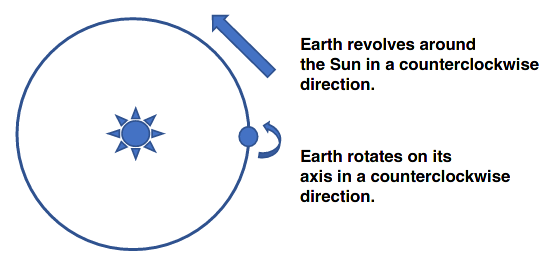{ width=60% }

### 1. The locations of the celestial sphere where the ecliptic and celestial equator cross are called:

a. solstices **[B. equinoxes]** c. celestial poles d. zeniths

## Daily versus Yearly Motions of the Sky

The illustrations in Figure 2 indicate the motions you would see in the night sky looking north while using a camera and
time exposures of a few hours. East is to the right and west is to the left. Notice that one star, Polaris (the North
Star), stays in the same position in all three illustrations. This is because Polaris is located close to the north
celestial pole (NCP).

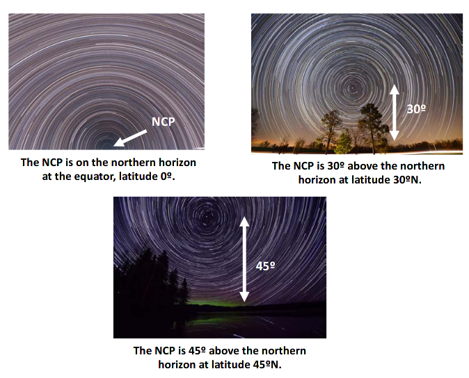{ width=60% }

| Facing North: Stars rotate counter-clockwise (right to left)
| Facing South: Stars rotate clockwise (left to right) - Toward the ecliptic
| Facing East: Stars rise in front, and set behind
| Facing West: Stars rise behind, and set in front

### 2. There is a definite trend in the altitude of the NCP above the northern horizon as viewed from different northern latitudes. State that trend.

As the latitude increases, so does the apparent NCP angle in a 1-to-1 relationship.

### 3. At what latitude are you currently?

Corvallis is at $44.56^o$ N.

### 4. If tonight were clear and you went out to find the star Polaris, how many degrees would it be above the northern horizon?

$44.56^o$ above the horizon.

### 5. Is the motion of the stars around Polaris (NCP) due to the rotation or revolution of Earth? Check the correct answer.

Star movements are caused by the Earth's rotation.

## As Earth revolves around the Sun, the apparent position of the Sun against the background constellations changes.

Figure 3 shows on September 1 the Sun appears in the direction of Leo. At midnight on September 1, we would look in
the direction of the constellation Aquarius.

By December 1, after 3 months have gone by, Earth has traveled far enough in its orbit so that the Sun is in Scorpius.
At midnight on December 1, we would look in the direction of Taurus. Note the location of Earth with respect to the
Sun at the equinoxes and solstices.

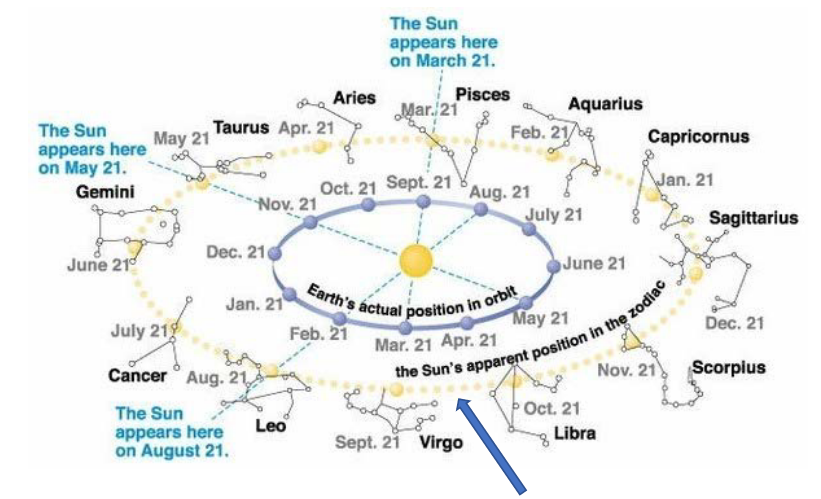{ width=70% }

### 6. If we assume the 12 constellations of the zodiac were evenly distributed along the ecliptic, about how long would the Sun "stay" in each constellation?

About 30 days (365 / 12).

### 7. Imagine that at noon on the northern summer solstice there is a total solar eclipse, and you can see the background stars in the middle of the day. The sky might look something like Figure 4. Notice the Sun is in the constellation of Gemini. On the same day 6 hours later, in which constellation would the Sun be?

a. Cancer **[B. Gemini]** c. Taurus d. Orion

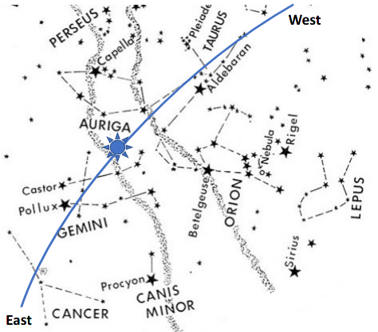{ width=50% }

## Reading Star Maps

We saw how the background of stars and constellations slowly changes over the course of a year in Figure 3. While objects rise and set on a daily basis, the time of rising and setting will not be the same over a year.

### 8. Carefully study Figure 5, which shows the night sky at midnight on the vernal equinox, the first day of spring. Use a straight edge and draw in the meridian. List four constellations that are on or close to the meridian (and are above the southern horizon for your location) at around midnight on the vernal equinox.

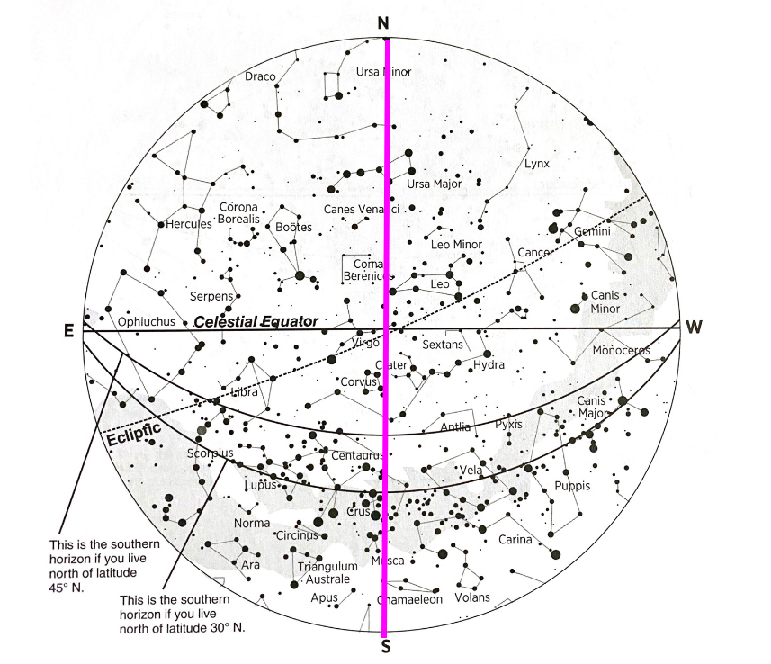{ width=50% }

### 9. Figure 5 also shows the sky at noon on September 21; that is, it is a map of the daytime sky on the autumnal equinox. In which constellation is the Sun located on the autumnal equinox?

a. Libra **[B. Virgo]** c. Leo

### 10. Draw in the meridian on Figure 6, as you did for Figure 5. This figure shows the night sky at midnight on the first day of summer, the summer solstice. List four constellations that are on the meridian and above the horizon at your latitude.

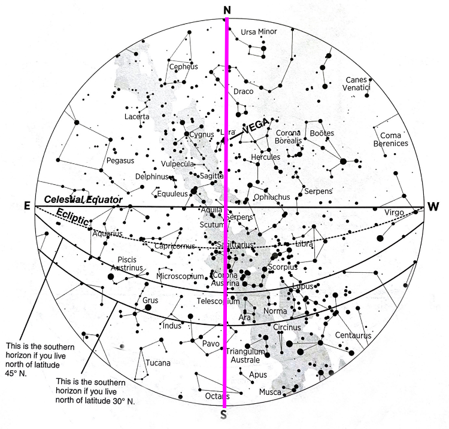{ width=50% }

Draco, Lyra, Pavo, Octans.

### 11. Pick one constellation that was on the meridian at midnight on the spring equinox (from Figure 5), name it, and describe how its location in the sky changed over one season.

Ursa Major rotated around the North of the star map $90^o$ between one season and the next.

### 12. The star map of Figure 6 also depicts the sky at noon on the winter solstice. Is the Sun above or below the celestial equator in the winter?

The Sun is below the celestial equator in winter.

### 13. In which constellation is the Sun located on December 21?

a. Capricornus **[B. Sagittarius]** c. Libra

### 14. As you take a look at Figure 7, which shows the night sky at midnight on the autumnal equinox, note that the bright star in Lyra, Vega, that was on the meridian on the summer solstice, is now in the northwest. Approximately how much time has passed between Figure 6 and Figure 7?

4 months, 1/4 of a year.

### 15. How does that amount of time relate to Vega’s change in location in the night sky? What causes both the change in time and Vega's change in position?

The time and positional change are due to the Earth's orbit around the Sun.

### 16. Figure 7 shows the stars in the sky at noon on March 21. In which constellation is the Sun on March 21?

a. Pegasus **[B. Pisces]** c. Aquarius

### 17. List five constellations shown in Figure 8 that lie on the ecliptic. This figure shows the night sky at midnight on the first day of northern winter – the winter solstice.

Leo, Cancer, Gemini, Taurus, Pisces.

### 18. The star map also represents the sky at noon on June 21. Is the Sun located above or below the celestial equator in summer?

The Sun is above the celestial equator in summer.

### 19. In which constellation is the Sun on June 21?

a. Cancer **[B. Gemini]** c. Taurus

### 20. Return to Figure 3 and draw straight lines from Earth at each equinox and solstice through the Sun to the opposite constellation. Then, review your answers given in Reading Star Maps for Figures 5-8. How does the way we view the yearly motion of Earth in Figure 3 relate to how we view the night sky using the star maps of Figures 5-8? Was investigating the sky from these two points of view helpful or not? Explain.

The star maps at midnight for each solstice/equinox face the opposite direction as the Sun. I didn't find the star maps
helpful to see what constellation the Sun was in; Figure 3 was much better at showing that.

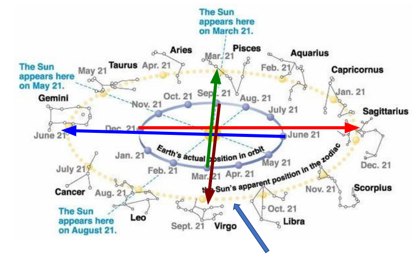{ width=70% }

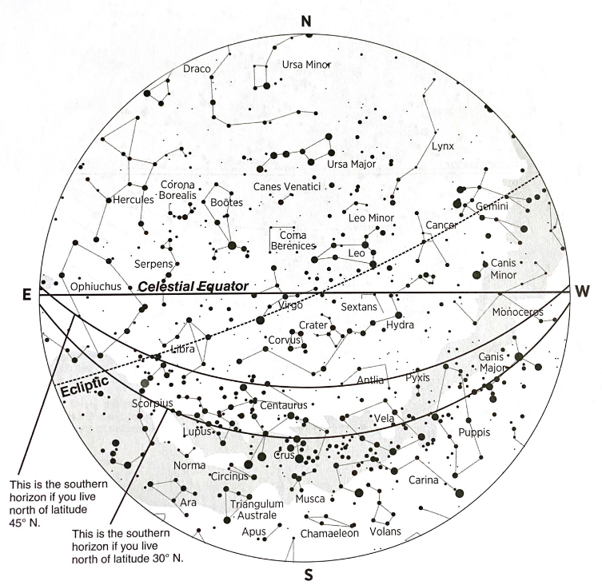

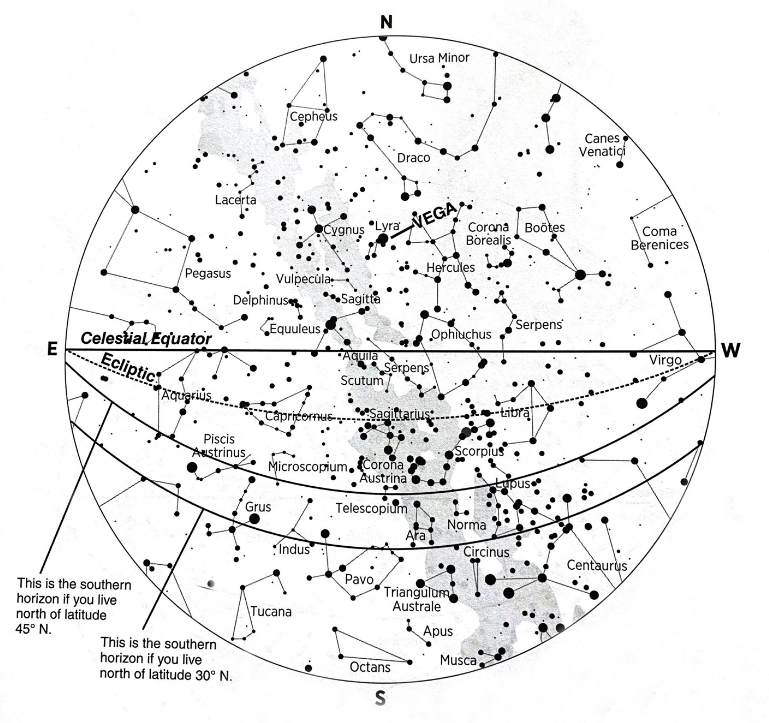

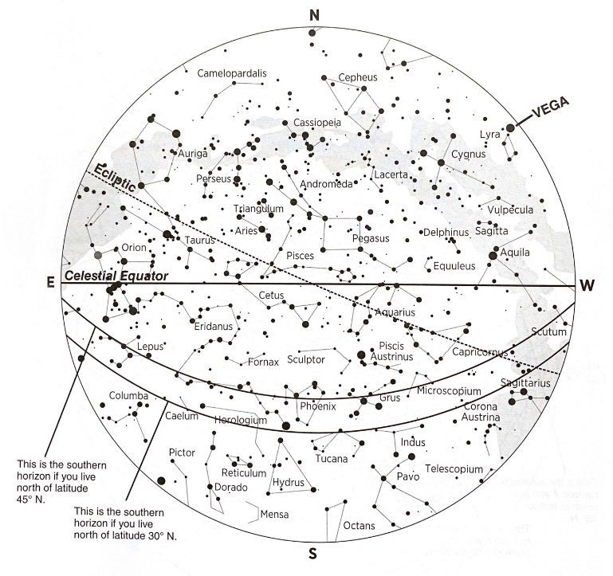

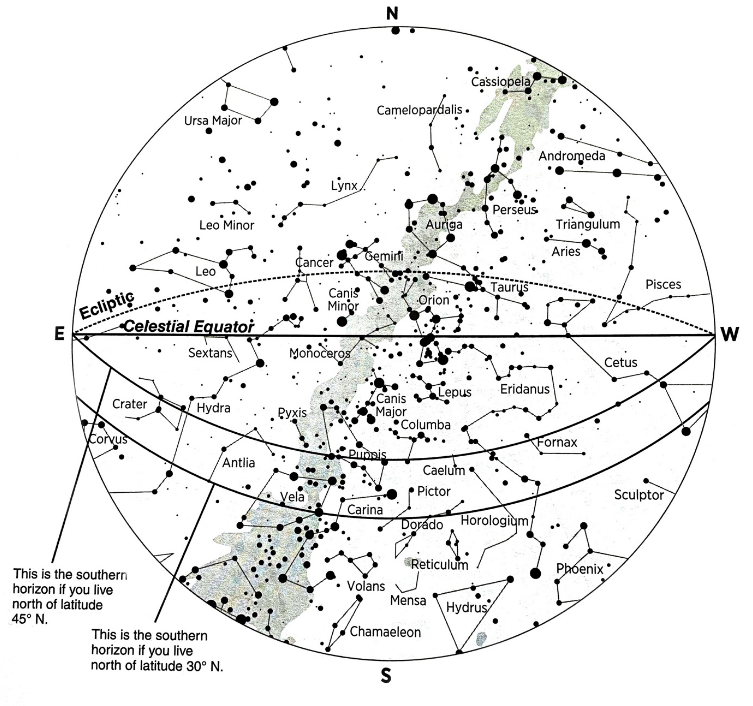
