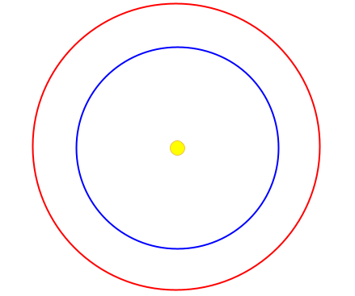

# PH 104 Lab 3: A Trip to Mars

## Robert Detjens

---

In this lab, you will revisit the math skills you’ll need in your studies of astronomy. The lab is meant to test your
ability to reason and understand using numbers (quantitatively). Let’s consider a manned trip to our neighbor planet,
Mars.

## Getting to Mars

One of the main challenges in traveling to Mars is the distance. Earth orbits the Sun at a distance of 150 million
kilometers (km), or about 93 million miles. Scientists express large numbers in scientific notation: a decimal number
between 1 and 10 followed by a power of 10. Example: The Earth-Sun distance breaks down to 1.50 x 10^2^ or (150) x
10^6^ (a million) kilometers. In scientific notation that is 1.5 x 10^8^ km.

### 1. Mars orbits the Sun at a distance of 228 million kilometers. Express this distance in scientific notation.

228 million kilometers = 2.28 x 10^8^ km

### 2. The Earth-Sun distance is convenient for comparison to other distances within the Solar System, so astronomers call the average Earth-Sun distance 1 astronomical unit, or 1 AU. Use the information above to determine the distance of the orbit of Mars from the Sun in AU.

2.28 x 10^8^ km / 1.5 x 10^8^ km = 1.52 AU

### 3. Mars and Earth each follow nearly circular (minimal ellipses) orbits around the Sun. Based on your distance calculations, draw an orbit diagram roughly to scale for the two planets in the space below.

{ width=50% }

### 4. Based on your orbit diagram, what is the minimum and maximum separation between Earth and Mars in AU? Indicate these positions in your diagram.

{ width=50% }
