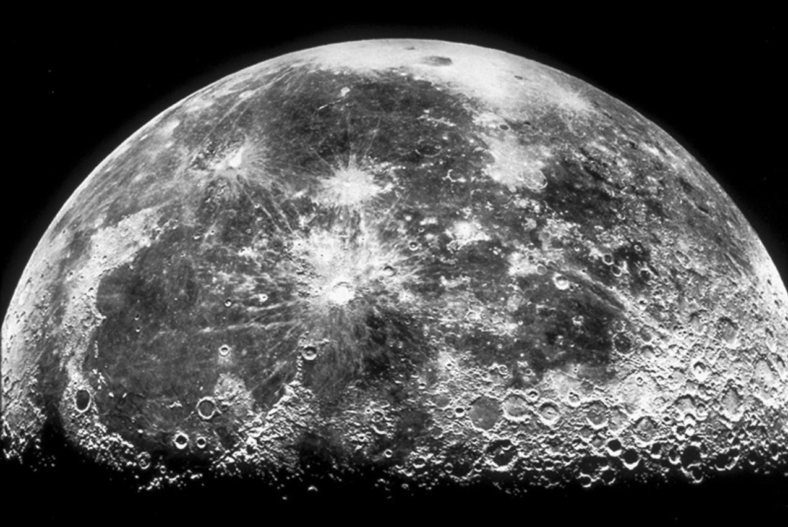
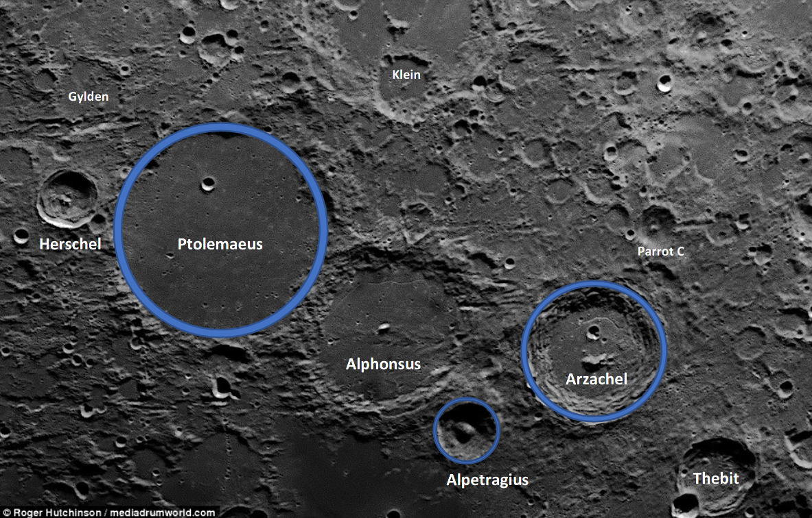
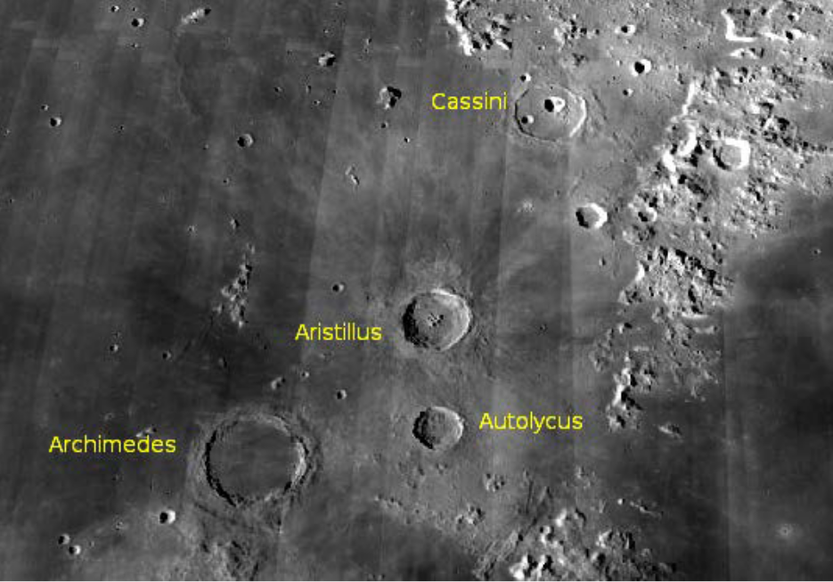
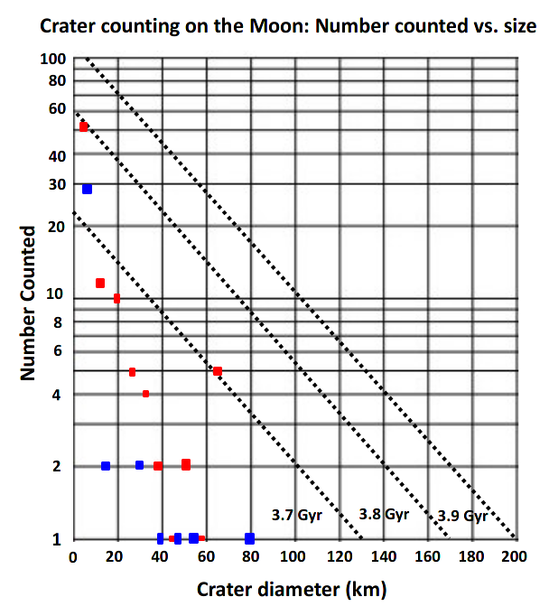

# PH 104 Lab 5

## Robert Detjens

---

# Finding Surface Ages from Crater Counts

Looking for celestial objects to study, we take the Moon for granted. It only takes a pair of binoculars or a spotting
scope to see details of the Moon’s mare (dark, relatively smooth "seas" of basalt), and craters of all sizes indicating
impacts from asteroids, meteoroids, and small comets starting billions of years ago.

Planetary scientists count the number of craters found in defined areas of planets and moons in order to estimate
relative ages of those areas. These counts are expressed as a number density. The number density differs from the more
common use of the word "density" meaning mass divided by volume. For this lab, number density represents: "The number
of craters of different sizes found within an area of a particular size." Thus, we can express "high" and "low" number
density.

We assume that there would be no select region of any planet or moon that would experience a greater impact rate than
any other region – all areas would be equally exposed to objects from space. Planetary scientists talk about "resetting
the clock" when resurfacing occurs. As an example, the Earth is about 4.6 billion years old, the land being formed by
lava flowing from Mauna Loa, Hawai’i is "just being formed." Geologically, the age of this new land can be just a few
minutes old.

In this lab you will study two contrasting regions of the Moon, and then extend your results to make a general
statement about the Moon. As a scientist you need to understand the fundamentals of any method before you have enough
confidence to use it.

$\pagebreak$

### 1. Examine the upper region of the Moon in Figure 1 and compare it to the lower region. How do the number densities of craters compare in each region?

The lower region of the Moon has considerably more craters than the upper section of the image.

### 2. What do your observations imply about the relative ages of the two regions?

The higher region's surface is newer than the lower region.

### 3. Thinking about your answers to questions 1 and 2 and write your hypothesis by finishing this sentence:

If the number density in the upper region of Figure 1 has a lower number density of craters than the lower region, then
the upper region has been resurfaced more recently.

### Ptolemaeus (154 km diameter), Arzachel (96 km), Alpetragius (40 km)

To develop an image scale, you need to know how many centimeters on the image correspond to a kilometer in space.
Calculate the image scale by dividing the size of each crater in kilometers by its size in the image in centimeters.
For example, consider a crater known to be 150 km in diameter that you measure to be 1.5 cm on an image. The image
scale factor for this example is 1 cm = 100 km.

### 4. Calculate the image scale factor for each of the three reference craters and average the values. Enter the average value for the scale factor into the "Cratered Highlands" section of Table 1.

Ptolemaeus: $4.3cm_{measured} = 154km_{actual} \rightarrow \frac{4.3cm}{4.3} = \frac{154km}{4.3} \rightarrow \bold{1cm
= 35.814km}$

Arzachel: $2.9cm_{measured} = 96km_{actual} \rightarrow \frac{2.9cm}{2.9} = \frac{96km}{2.9} \rightarrow \bold{1cm =
33.103km}$

Alpetragius: $1.4cm_{measured} = 40km_{actual} \rightarrow \frac{1.4cm}{1.4} = \frac{40km}{1.4} \rightarrow \bold{1cm =
28.571km}$

Averaged: $\frac{35.814 + 33.103 + 28.571}{3} = \bold{32.496km/cm}$

### 5. In Figure 2, count the number of craters of each size (count as many craters as you can). Insert the results in Table 1. Be careful not to count craters twice. Count even the faintest craters you can see and those that overlap other craters. Because you are restricting your measurements to what are known as "binned" sizes, pick the closest size as you enter the counts in the table. If you do not locate a crater of a given diameter, enter 1 for the number counted. As with all measurements, it is important that you are consistent in the methods you use.

### 6. For each of the crater sizes listed in the "Cratered Highlands" section of Table 1, enter the corresponding diameter in kilometers by applying the average scale factor.

$\pagebreak$

Cratered Highlands scale factor: 1cm = 32.496km $\hspace{20px}$ Upper Mare Region scale factor: 1cm = 39.928km

| Measured size | Actual size | No. counted |  | Measured size | Actual size | No. counted |
|---------------|-------------|-------------|--|---------------|-------------|-------------|
| >= 2          | 64.992      | 5           |  | >= 2          | 79.856      | 1           |
| 1.8           | 58.493      | 1           |  | 1.8           | 71.8704     | 0           |
| 1.6           | 51.994      | 2           |  | 1.6           | 63.8848     | 0           |
| 1.4           | 45.494      | 1           |  | 1.4           | 55.8992     | 1           |
| 1.2           | 38.995      | 2           |  | 1.2           | 47.9136     | 1           |
| 1.0           | 32.496      | 4           |  | 1.0           | 39.928      | 1           |
| 0.8           | 25.997      | 5           |  | 0.8           | 31.9424     | 2           |
| 0.6           | 19.498      | 10          |  | 0.6           | 23.9568     | 0           |
| 0.4           | 12.998      | 14          |  | 0.4           | 15.9712     | 2           |
| <= 0.2        | 6.4992      | 52          |  | <= 0.2        | 7.9856      | 29          |

### 7. Following the steps in Question 4 - 6, fill out the right-hand side of Table 1 by measuring craters seen in Figure 3 (following page), showing a small part of the upper mare region of the Moon. You will need to find the image scale for this image using the three reference craters, Archimedes (83km), Aristillus (55km), Autolycus (39km). Enter the average value for the scale factor into the "Upper Mare Region" section of Table 1.

Archimedes: $2.0cm_{measured} = 83km_{actual} \rightarrow \frac{2.0cm}{2.0} = \frac{83km}{2.0} \rightarrow \bold{1cm =
41.5km}$

Aristillus: $1.4cm_{measured} = 55km_{actual} \rightarrow \frac{1.4cm}{1.4} = \frac{55km}{1.4} \rightarrow \bold{1cm =
39.286km}$

Autolycus: $1.0cm_{measured} = 39km_{actual} \rightarrow \frac{1.0cm}{1.0} = \frac{39km}{1.0} \rightarrow \bold{1cm =
39km}$

Averaged: $\frac{41.5 + 39.286 + 39}{3} = \bold{39.928km/cm}$

### Graphing Data, Drawing Conclusions

The graph shown in Figure 4 uses a logarithmic scale for the y-axis and a linear scale for the x-axis. The diagonal
lines show the surface ages based on crater counts, from 3.9 billion years (giga-years; Gyr) down to 3.7 billion years.
Scientists used radiometric dating of Moon rocks brought back by Apollo astronauts to find these actual ages. The
sunlit part of the images you measured covers just about 125,000 square kilometers, so you can compare your results to
published results, as the diagonal lines represent counts versus diameter over 125,000 square kilometers as well.

### 8. Graph the number of craters you counted versus their actual sizes for both the cratered highlands region and the upper mare region. Use different colors for the two regions. Make a note of the colors you use here:

Color used for Cratered Highlands: Red

Color used for Upper Mare Region: Blue

( graph on next page )

{ width=50% }

### 9. What do the numbers and densities of the craters imply about the relative ages of these two lunar regions? Do your results support the hypothesis you made in Question 3? Comment.

On average, the Upper Mare region is closer to the bottom-left of the graph, signifying that the surface of that region
is younger than that of the Cratered Highlands. These results do support the hypothesis made in Q3.

### 10. Comparing crater densities on a terrestrial world easily leads to a statement of relative ages, but relating crater densities to actual age for the Moon required sending astronauts there to bring back rocks to be radiometrically dated. This is how the straight lines in Figure 4 are determined.

A) Based on your results, what are the approximate ages / age ranges for the Cratered Highlands and Upper Mare regions?

   The Cratered Highlands appears to be about 3.6 Gyr old, Upper Mare possibly 3.3 Gyr (but somewhat hard to tell as
   the age estimate is extrapolated from the three given lines and may not be very accurate)

B) What are the advantages and disadvantages in finding relative versus actual ages?

   Relative aging is much easier to perform, only needing visual analysis of the surface. Retrieving rocks from the
   lunar surface is an extremely complicated endeavor but will beget much more accurate results, as the material in
   question can be physically examined.
