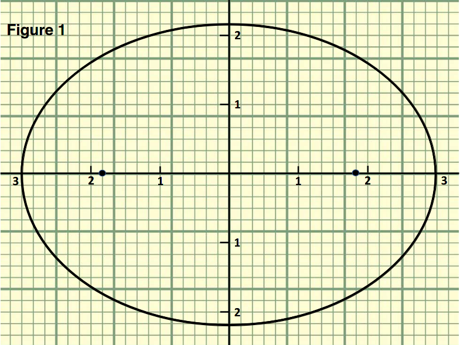
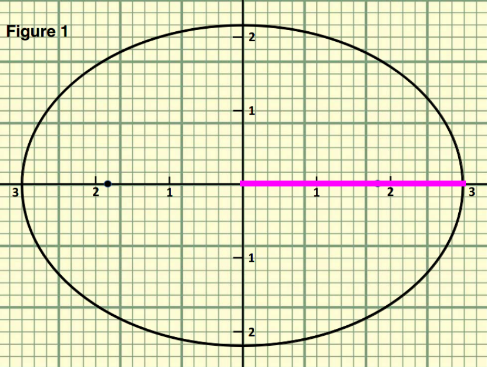
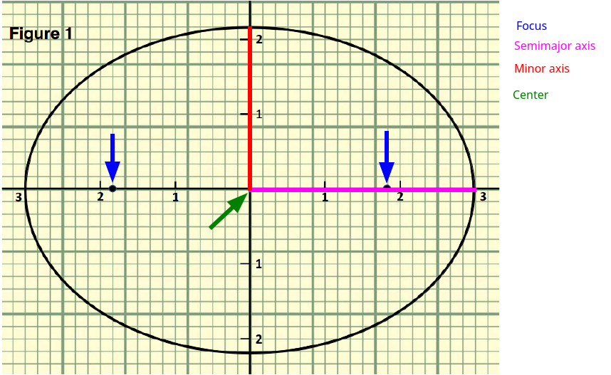
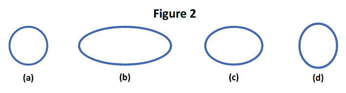
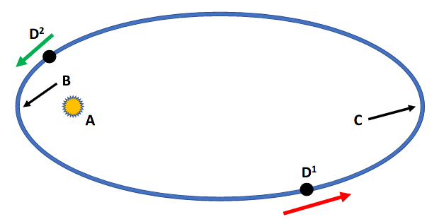
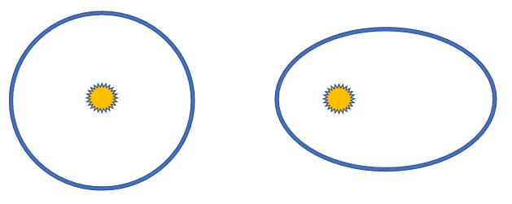
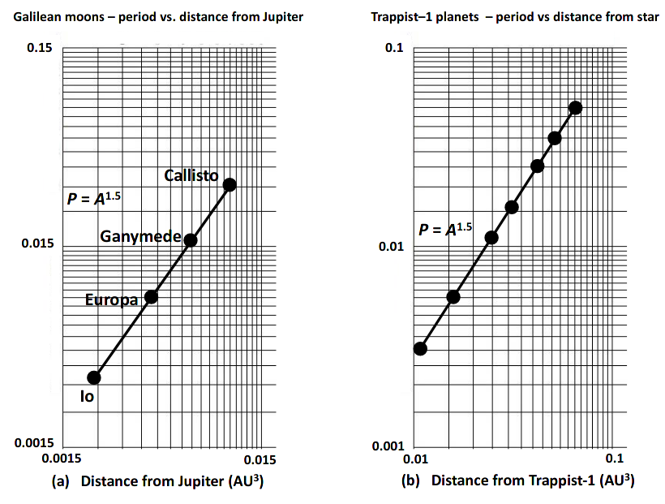

# PH 104 Lab 6

## Robert Detjens

---

Johannes Kepler was a finicky person when it came to understanding data given to him by his supervisor and mentor Tycho
Brahe. Kepler took a particularly precise, careful, persnickety approach to making calculations of planetary orbits. By
adopting the shape of an ellipse for the orbits of the planets in the Solar System, Kepler's predictions precisely fit
the observations of their positions at any given time. Ellipses are elongated circles (Figure 1). An ellipse has a
minor axis (short axis), and a major axis (long axis). An ellipse is drawn around two points or foci. For an elliptical
orbit, the Sun is located at one focus; there is nothing at the other focus. This observation, that planets move in
ellipses, is Kepler's First Law. Kepler was also able to describe the motions of planets based on the ellipse. Planets
move the fastest when they are passing closest to the Sun, or at perihelion. Planets move slowest when they are
farthest from the Sun, or at aphelion.

Kepler's Second Law describes how the speed of a planet changes with position in its orbit. Years later, after studying
the data for planets known at that time, Kepler found there was a definite relationship between how long a planet takes
to orbit the Sun -- its period -- and its average distance from the Sun. The average distance from the Sun is equal to
the semimajor axis, which is found by dividing the length of the major axis by two. This relationship is Kepler's Third
Law.

{ width=70% }

$\pagebreak$

### 1. Highlight the semimajor axis of the ellipse in Figure 1. If the numbers on the graph are AU, what is the length of the semimajor axis of the ellipse?

The length of the semimajor axis is 3 AU.

{ width=60% }

## Kepler's First Law

Figure 1 features Kepler's first law: the orbits of the planets are ellipses with the Sun at one of the foci.

### 2. Clearly label the following parts of an ellipse on Figure 1.

{ width=70% }

### 3. Eccentricity is a measure of the degree of "flattening" of an ellipse. The eccentricity of an ellipse is defined as the distance from a focus to the center of the ellipse divided by the length of the semimajor axis. You already found the length of the semimajor axis in Question 1. Use the graph paper grid to find the distance from the focus to the center for the ellipse in Figure 1.

$D_{focus} = 1.833 AU$

### 4. Calculate the eccentricity of the ellipse in Figure 1 by dividing the distance from the focus to the center by the semimajor axis.

$\frac{1.833}{3} = 0.611$

### 5. A circle is a special ellipse, one with both foci at the same point. The eccentricity of a circle is 0. The value of the eccentricity of an orbit may run from 0 to almost 1. Figure 2 shows four examples of ellipses. Rank them from the smallest eccentricity to the largest.

{ width=60% }

$$
(smallest) A \rightarrow D \rightarrow C \rightarrow B (largest)
$$

### 6. State how to determine the eccentricity of an ellipse. If you'd like, you may draw a figure or figures to express your thoughts.

$$
Eccentricity = \frac{Dist_{center \rightarrow focus}}{Length_{semimajor}}
$$

$\pagebreak$

## Kepler's Second Law

Kepler's Second Law states as a planet moves around its orbit it sweeps out equal areas in equal times. This law can be
difficult to visualize; it may be easier to consider this simpler description: A planet travels faster when nearer to
the Sun and slower when it is farther from the Sun.

### 7. Figure 3 shows a planet, D, orbiting a star, A, in a counterclockwise direction. Match the following terms with the letter identifying the location in the figure.

{ width=80% }

- Focus: A
- Aphelion: C
- Perihelion: B
- Increasing speed: D^2^
- Decreasing speed: D^1^
- Planet has fastest speed: B
- Planet has slowest speed: C

### 8. State Kepler's Second Law and give the physics' reason whey planets behave this way in orbit.

As a planet moves around its orbit it sweeps out equal areas in equal times.

This is because the gravitational pull of the star is stronger when an object is closer to it. As the planet gets
closer, gravity exerts more force and speeds up the planet.

$\pagebreak$

## Kepler's Third Law

Kepler's Third Law relates the time required for a planet to go around its star (the period, P ) to the semimajor axis,
A, of its orbit. If we measure P in years and A in astronomical units (AU), the relationship formula is: $p^2 = A^3$.

### 9. According to Kepler's Third Law, all orbits with the same semimajor axis have the same period. The two orbits in Figure 4 have the same value for A and thus must have the same P, but how is this possible when the orbits have such different eccentricities? Think about the question from this perspective: for a planet with a circular orbit, eccentricity = 0, does the distance of an object orbiting a star change?

{ width=70% }

If the orbit is a circle (eccentricity == 0), the orbiting object's speed does not change. The eccentric-orbiting
object's speed varies along its orbit due to Newton's Third Law, causing it to have the same orbital period.

$\pagebreak$

## Putting It Together

We know Kepler’s laws work for all objects orbiting the Sun, and we assume the orbits of comets, asteroids, moons, and
exoplanets obey the first two laws, But what about Kepler’s Third Law? Is the Third Law a universal law, applicable
across the Universe? If it is, then we should find $p^2 = A^3$ applies in every case.

The period versus the distance from Jupiter for the Galilean moons is shown in Figure 5, and shows the period versus
distance from the star Trappist-1 for its six known planets. Trappist-1 is 39.46 light-years away from Earth. Its
planetary system was discovered in 2016, and is one of a large number of stars discovered to have multiple planets
orbiting about them.

The data for Jupiter and Trappist-1 are shown as black dots in each graph in Figure 5. Notice in the Figure 5 graphs,
Kepler’s Third Law (black lines) is shown to be first solving for the period: $P = \sqrt{A^3} = A^{1.5}$ The axes of
the graphs are logarithmic. On this kind of graph, a relationship in which one variable is a power of another shows up
as a straight line.

{ width=70% }

### 10. Describe how Kepler's Third Law is used when astronomers are investigating moons orbiting a planet in our Solar System, or exoplanets orbiting distant stars. Be sure to use at least three key terms from this lab.

Kepler's Third Law can be used to find the period of an orbiting body based on the distance (along the semimajor axis)
between the orbiting and orbited bodies. Assuming a small orbital eccentricity, it can also be used to find the
distance between the orbited and orbiting bodies given the period.
