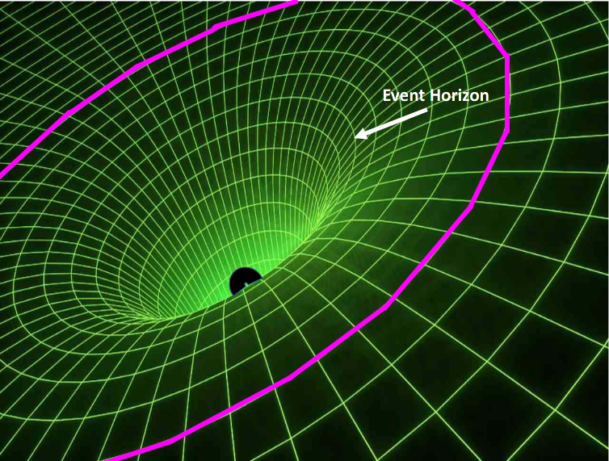

# PH 104 Lab 7

## Robert Detjens

---

## Background

During our lecture about black holes, we learned Einstein's idea of objects with mass bending or warping space-time -
the more massive an object, the more space-time is bent. In this lab you will consider the ultimate bending of
space-time by a black hole. Black holes bend space-time so severely objects would have to travel faster than the speed
of light to escape from the "pit" in space-time. Objects far from a black hole experience gravity normally, as if the
black holes were a star with the same mass. As objects come closer to the black hole, they have to travel faster to
get out of the warped space-time and to an area not warped by the black hole's mass. At a particular distance from the
black hole, an object has to travel faster than the speed of light to escape. The sphere of distance around a black
hole - "the point-of-no-return" - is the Event Horizon. No object can escape the gravity well of a black hole once
it has crossed the event horizon, because no known object can travel faster than the speed of light.

Because we cannot bring a black hole into a laboratory and because astrophysicists, astronomers, and physicists have
never observed a black hole directly, we can only conduct "thought experiments" to explore the properties of black
holes. These thought experiments involve a big rubber sheet, similar to a trampoline, that is stiff and not easily
stretched, but does have some give. This sheet is held parallel to the ground. Adding a heavy object, such as a bowling
ball, to the sheet will make the sheet bend downward. Smaller objects, such as golf balls, tennis balls, or even ping
pong balls, are light enough to make little to no perceptible bend in the rubber sheet. A bend in the sheet changes the
trajectory, or path, of objects rolling across the sheet, just as the presence of mass in space changes the trajectory
of objects moving past it. (You can attempt a version of this thought experiment on you own. Stretch your bedding tight
and roll some small balls, such as a golf ball, across the surface. Then place a heavy object in the center of your
bedding and then roll the small ball across the surface and observe how the smaller ball reacts to the presence of the
larger object.)

### 1. Suppose the Sun were replaced by a black hole with a mass equal to the mass of the Sun. The event horizon of such a black hole would have a diameter of about 6 km. Would Earth orbit normally, or would it spiral into the black hole? Explain your answer.

Since the replacement has the same mass, the gravitational "divot" in space-time would not change. Earth would continue
to orbit as normal (albeit in darkness).

## Black Holes in Two Dimensions

### 2. Imagine a big rubber sheet (Figure 1). Imagine rolling three golf balls across the sheet in a direction you choose. Using a black pen or pencil, sketch their paths across Figure 1.

{ width=40% }

### 3. Now imagine putting a bowling ball in the middle of the sheet to make a big, slope-sided pit, as shown in Figure 2 and Figure 3. On Figure 1, sketch the paths of three golf balls rolled across the sheet on the following trajectories:

a) With a red pen or pencil, sketch the path of a golf ball far from the bowling ball, near the edge of the sheet.
b) In blue, sketch the path of a golf ball going directly toward the bowling ball.
c) In a color of your choice, sketch the path of a golf ball coming close to the bowling ball but not directly at it.

{ width=40% }

### 4. In each of the three cases of Question 3, how would things change if the golf balls were moving faster?

a) The slight bend in the red ball's trajectory would dissapear as it goes faster.
b) The blue ball would still fall straight into the gravity well, so no change.
c) The bend in the pink ball's trajectory would become straigher as it goes faster.

### 5. In each of the three cases of Question 3, how would things change if the golf balls were moving slower?

a) The slight bend in the red ball's trajectory would get larger as it slows down.
b) The blue ball would still fall straight into the gravity well, so no change.
c) The bend in the pink ball's trajectory would become larger as it slows down.

### 6. Imagine sending lots of golf balls into the pit. What happens to the depth and width of the pit as the golf balls fall into the pit's center near the bowling ball?

Each ball's weight contributes to the pit, so as more balls fall into it the pit would grow larger.

### 7. In the first example (Question 2), the representation of space-time is flat; in the second example (Question 3), a massive object placed in the center bends space-time significantly. How do these examples explain the concept of bent space-time in terms of the objects rolling across the rubber sheet?

The bend of the sheet is representing gravitational attraction between objects. A large pit creates steep bends around
it, similar to how a massive star or black hole has an extremely strong gravitational pull around itself.

$\pagebreak$

A pit is a fair two-dimensional analogy for a black hole. Objects outside the pit will "know" the black hole is there
because the sheet is sloping, but they won't be captured unless they come within the event horizon. This is the
location at which light bends exactly into a circle around the black hole. Figure 4illustrates the event horizon and
black hole in perspective.

Now think about light as though it were copper BBs rolling across the sheet extremely fast.

### 8. Using Figure 4, sketch the path of one copper BB light particle if it were to travel:

a) far from the singularity, near the edge of the sheet. (red)
b) directly toward the singularity. (green)
c) on a line tangent (just touches) the event horizon. (blue)
d) inside the event horizon, but not directly at the singularity. (magenta)

{ width=40% }

Stars, people, planets, all things interact in this way because of gravity. For black holes it is a little more
accurate to think of the bowling ball as making a very deep hole - so deep nothing can bounce out - but the sheet is
still bent.

### 9. Think about what happens when you roll the slower-than-light golf balls past the pit. Sketch and label a circle on Figure 4that would mark a "golf ball event horizon." If the golf balls are inside this circle, they cannot escape.

{ width=40% }

### 10. Is the "golf ball event horizon" you sketched closer, farther, or the same distance from the bowling ball than the light event horizon illustrated in Figure 4? Why? (Think about how the speed affects the motion of objects around the pit.)

The golf ball horizon is farther away from the black hole / bowling ball, as as you get closer to the black hole the
speed required to come out of the pit increases as the sides get steeper.

### 11. Suppose you roll another bowling ball across the sheet. What happens to the sheet when the second bowling ball falls in after the first?

The pit would get even steeper, as there is now twice the mass stretching the pit.

### 12. How would this affect the paths of the golf balls? How about the example of a copper BB light particle?

The event horizon would widen as the pit gets deeper. The tangent particle would now fall inside the new event horizon
and would become trapped. The particle further away would be slightly pulled in more but would not get trapped. The
golf balls would act in the same way, but the horizons would be further out to reflect their slower speed.

### 13. From your experience with these thought experiments, give a definition of event horizon consistent both with golf balls rolling on a bent rubber sheet and with light interacting with bent space-time around a black hole.

The event horizon is the distance from the black hole at which a particle can no longer escape the gravitational pull
under its own momentum.

$\pagebreak$

## Black Holes in Three Dimensions

The thought experiments you just carried out are two-dimensional metaphors for a three-dimensional bending of space-time. To think about black holes more accurately, you need to add a third dimension in which the same effects apply, this is much more difficult than it might seem, because now the rubber sheet is no longer flat with a central pit but is bent from all directions toward the center no matter from which direction golf balls or light approach.

### 14. Imagine that a golf ball is fired into Figure 4 from above the page.

a) If the golf ball starts out aimed at the very edge of the sheet, far from the black hole, what will happen to it? Why?

  The golf ball will travel fairly straight, as this is equivalent to firing the ball along the edge of the sheet.

b) If the golf ball is aimed at a point closer to the black hole, but not within the "golf ball event horizon," what will happen to it? Why?

  Its trajectory will bend severely, as like the magenta golf ball.

c) If the golf ball is aimed directly at the bowling ball, what will happen to it? Why?

  It will fall directly into the black hole, as all momentum is directed straight into the pit.

### 15. Using the key terms of the laboratory, summarize how objects behave near a black hole. How does the mass, velocity, or trajectory of the object affect its behavior? Describe how the rubber sheet analogy works for understanding the bending of space-time and how it fails.

Objects that get close to a black hole are affected by its gravity well. The trajectory will bend around the black hole
more and more as an object passes closer, eventually passing the Event Horizon past which the object cannot escape. A
faster object can travel closer to the black hole before entering the event horizon, as the greater speed allows it to
escape the stronger gravitational attraction. The "rubber sheet" analogy works well to visualize the "deflection" of
space-time around a black hole due to gravity, but does not translate directly into three dimensions, as the sheet is
only 2D.
